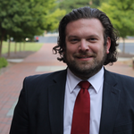

## Work
Zack currently serves as the Executive Director of Assessment, Accreditation, and Medical Education for the Campbell University Jerry M. Wallace School of Osteopathic Medicine (CUSOM).  He is an experienced Executive Director with a demonstrated history of working in the higher education industry in assessment, accreditation, and planning. Skilled in various aspects of technology and software applications, needs assessment, program, course, and faculty evaluation, academic advising, assessment, and curriculum development. 

## Academic
Zack has his Bachelor of Science degree in Mathematics with minors in Computer Science and Physics and his Master of Science degree in Education, both from Wilkes University in Wilkes-Barre, Pennsylvania. Additionally, he has earned over 40+ credit hours in graduate-level mathematics coursework from Temple University (Philadelphia, PA). Zack is a second-year PhD student in the Learning and Teaching in STEM – Mathematics and Statistics Education program. For nearly the past decade, Zack has worked professionally in assessment, accreditation, and medical education at two medical schools, one allopathic and one osteopathic, and has taught Biostatistics at various levels for the past seven years. His professional and research interests include: statistics education, teaching and learning statistics, statistical thinking, biostatistics, evaluation and assessment, curriculum development, empathy, and learning theories.

## More Information

For more information please visit my [LinkedIn page](https://www.linkedin.com/in/zachary-vaskalis-500b8023/).

## Contact me

**_Email:_** [ztvaskal@ncsu.edu](mailto:ztvaskal@ncsu.edu)  

